# Data Analysis AI — Technical Report

This document summarizes system architecture, LLM integration, agentic behavior, challenges, evaluation, and future work for the project in this repository.

**Diagrams:** Figures use [Mermaid](https://mermaid.js.org/) syntax. They render on GitHub and in many Markdown previews. If your viewer does not support Mermaid, paste fenced blocks into [mermaid.live](https://mermaid.live).

---

## 1. System Architecture

### 1.1 Layered stack (logical tiers)

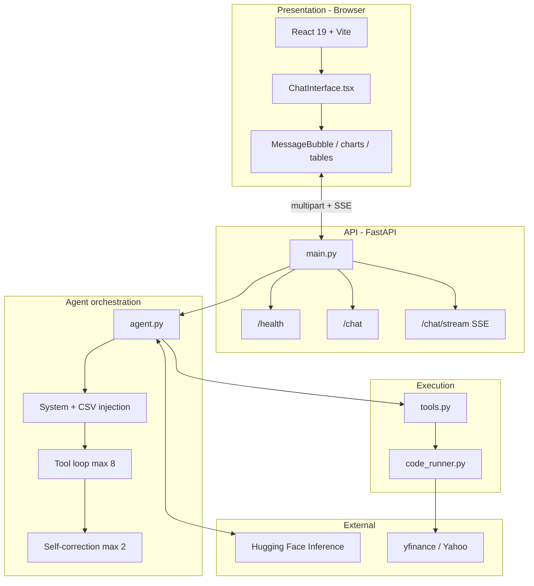

### 1.2 Component diagram (services and data flow)

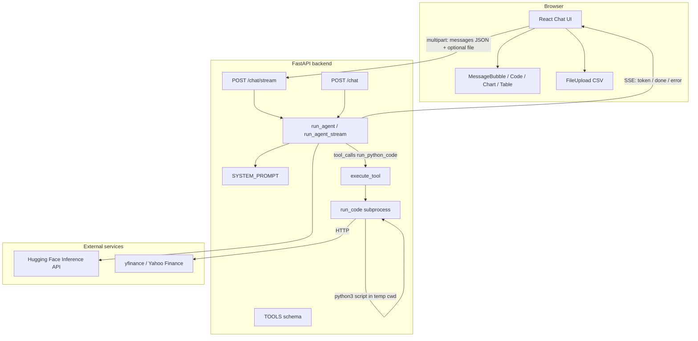

### 1.3 Streaming chat — sequence (happy path with one tool call)

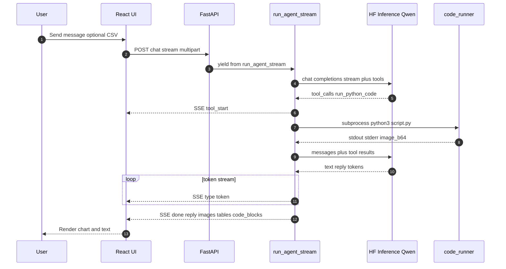

### 1.4 Code runner — temp workspace (conceptual)

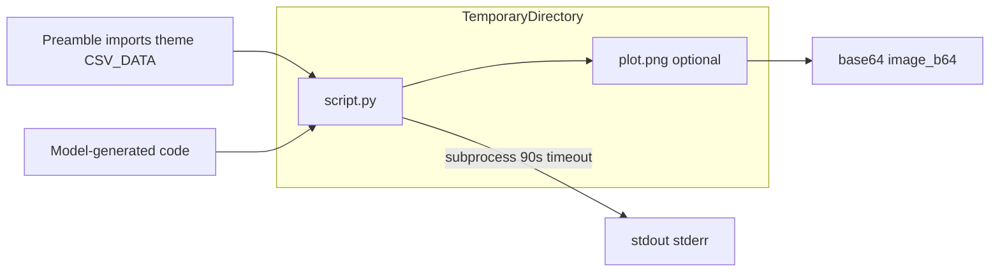

### 1.5 Written description

- **Frontend (Vite + React):** `ChatInterface.tsx` manages messages, builds `FormData` with JSON `messages` and an optional CSV, and calls **`POST /chat/stream`**. It parses Server-Sent Events (`data: {...}`): **`token`** events append to the assistant message; **`done`** supplies final `reply`, `code_blocks`, `images`, and `tables`. `MessageBubble` renders prose, syntax-highlighted Python, base64 PNG charts, and tabular JSON; it strips partial inline base64 image markdown during streaming.
- **Backend (FastAPI):** `main.py` exposes `/health`, `/chat` (JSON `ChatResponse`), and `/chat/stream` (SSE). CORS allows local dev origins and the Render-hosted frontend. The LLM is accessed via **`huggingface_hub.InferenceClient`** using **`HF_TOKEN`**.
- **Agent (`agent.py`):** Builds internal messages: system prompt, optional CSV injection (truncated to 50k characters plus a short synthetic assistant line), then the user conversation. Loops up to **8** iterations with tool-enabled chat completions. On `run_python_code`, executes code, collects stdout/stderr, optional `plot.png` as base64, and parses JSON printed to stdout into **tables**. **Self-correction:** up to **2** retries when stderr indicates a real error (excluding warning-only stderr).
- **Tools (`tools.py`):** Single function tool **`run_python_code`** with parameters describing the sandbox and `CSV_DATA` usage.
- **Runner (`code_runner.py`):** Prepends imports, Bloomberg-style matplotlib theme, **`yf_download`** helper (retries for rate limits), and `CSV_DATA`. Runs **`subprocess.run(["python3", script.py], timeout=90, cwd=temp dir)`**, returns stdout, stderr, and base64 image if present.

**End-to-end flow:** User message (and optional CSV) → FastAPI → Hugging Face model may emit tool calls → Python runs in a temporary directory → tool results appended to history → model continues until a final natural-language reply → UI shows text, code, charts, and tables.

---

## 2. LLM Integration

### 2.1 Model and provider

| Item | Value |
|------|--------|
| **Model** | `Qwen/Qwen2.5-72B-Instruct` (`MODEL` in `agent.py`) |
| **Provider** | [Hugging Face Inference API](https://huggingface.co/docs/huggingface_hub/guides/inference) via `InferenceClient` |

**Rationale:** A capable instruction-tuned model at this scale supports **tool calling** and **Python generation** while keeping inference **hosted** and gated by an API token, which fits a student/deployed demo without self-hosting GPU weights.

### 2.2 System prompt — topic map (`system_prompt.py`)

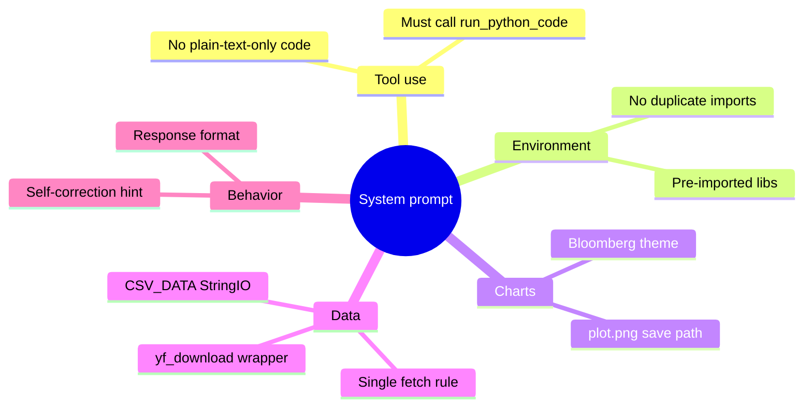

### 2.3 System prompt design

- **Mandatory tool use:** Computation and plots must go through `run_python_code`, not “paste this in your terminal.”
- **Environment contract:** Lists pre-imported libraries so the model avoids duplicate imports and import errors.
- **Visual contract:** Bloomberg-style defaults; fixed `plt.savefig('plot.png', ...)` / `plt.close()` so the runner can always pick up the artifact.
- **Data discipline:** Use **`yf_download`** (not raw `yf.download`); fetch external data in **one** tool call when possible; CSV via **`CSV_DATA`** + `pd.read_csv(io.StringIO(CSV_DATA))`.
- **Self-correction alignment:** Prompt tells the model to fix stderr and retry (matching the server-side retry injection).

### 2.4 Prompt engineering techniques

- **Structured sections** (tool, chart, yfinance, fetch, correction, CSV, response format) for parseability by the model.
- **Negative constraints** (“do not import again,” “do not override theme,” “never split fetches across tool calls”).
- **Copy-paste templates** for save path and CSV loading.
- **Tool schema mirroring** in `tools.py` so API-level descriptions match the system prompt.

### 2.5 Tool and response contract (class view)

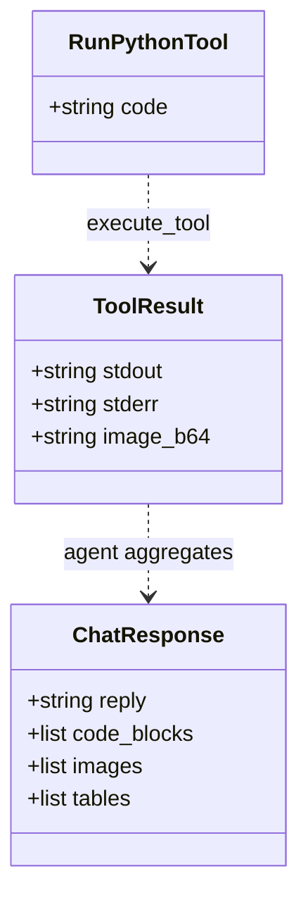

---

## 3. Agentic Patterns

### 3.1 Agent control loop (iterations and exit)

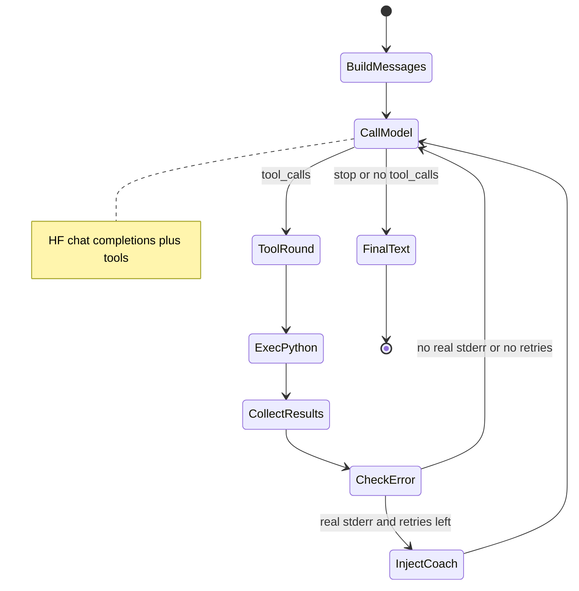

### 3.2 Self-correction decision (stderr classification)

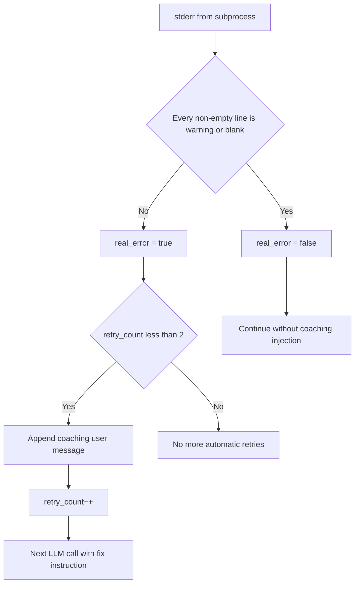

### 3.3 Pattern summary

| Pattern | How it appears in the system |
|---------|------------------------------|
| **Tool use** | Model emits `run_python_code` with a `code` string; server executes and returns JSON. |
| **Iterative loop** | Up to **8** LLM rounds; multiple tool rounds before a final answer. |
| **Observe–act** | stdout/stderr/image feed the next model call as tool role messages. |
| **Self-correction** | On real stderr, inject a user message with the error and ask for a fixed tool call; **2** max attempts. |
| **Warning filtering** | stderr lines that are only warnings (or blank) do not trigger the correction path. |
| **Streaming agent** | `run_agent_stream` aggregates streaming tool-call fragments, runs tools, emits `tool_start`, streams final reply tokens, then `done` with artifacts. |

### 3.4 SSE event shapes (streaming)

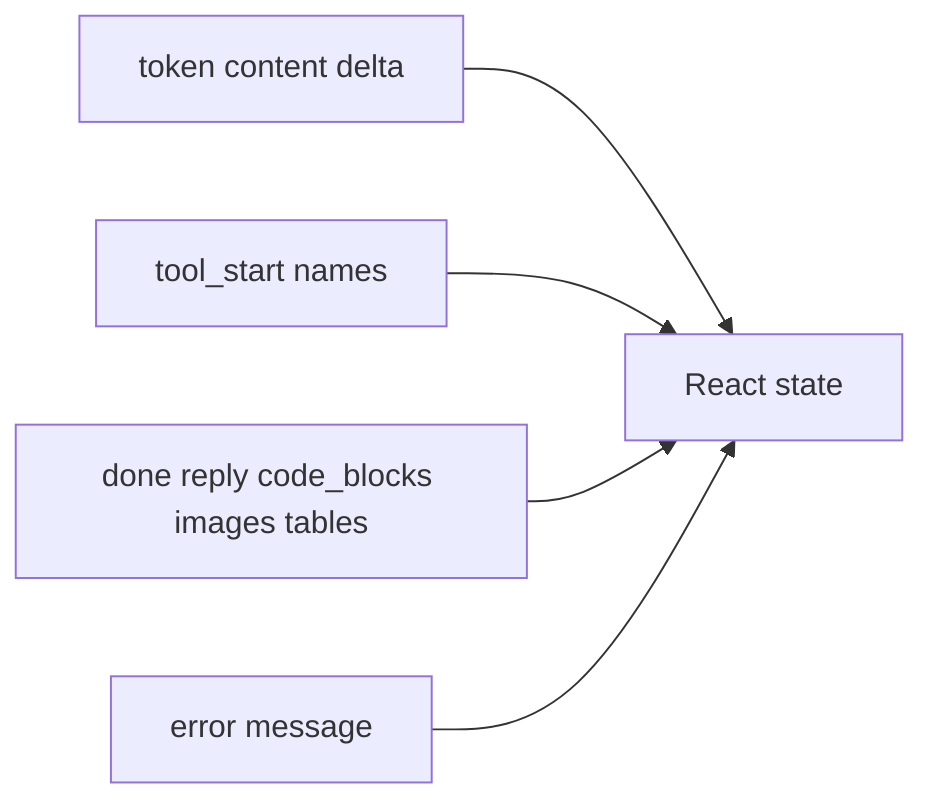

---

## 4. Challenges and Solutions

### Challenge A: `yfinance` rate limits and fragile DataFrames

**Problem:** HTTP 429s and MultiIndex columns from `yf.download` break charts and statistics.

**Solution:** `yf_download()` in `code_runner.py` with retries, backoff, and column flattening; system prompt requires using this helper instead of `yf.download` directly.

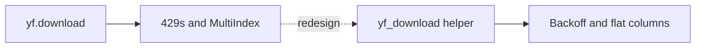

### Challenge B: stderr noise vs. real failures

**Problem:** Libraries emit warnings to stderr even when a plot succeeds; naive “any stderr = error” causes false retries.

**Solution:** Treat stderr as failure only if not every non-empty line is a benign “warning” (see `real_error` in `agent.py`).

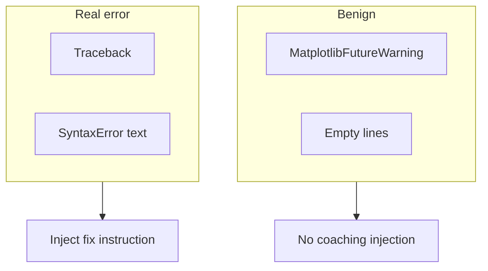

### Challenge C: Streaming plus tool artifacts

**Problem:** Users expect token streaming, but charts and code arrive only after tool execution.

**Solution:** SSE event types (`token`, `tool_start`, `done`, `error`) and a final `done` payload that includes `code_blocks`, `images`, and `tables`.

---

## 5. Evaluation

### 5.1 Reliability layers (conceptual)

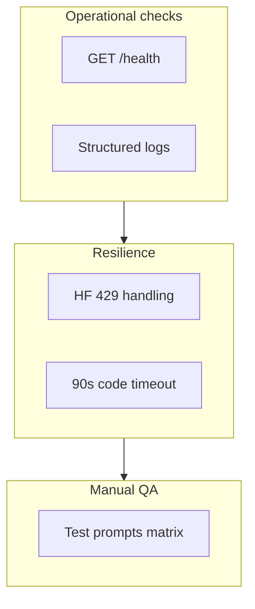

**Reliability checks used in development:**

- **`GET /health`** for service liveness (including cold starts on Render).
- **Logging** across agent, tool, and runner (iterations, finish reasons, timings, stderr snippets, image capture).
- **429 handling** when Hugging Face rate-limits (`main.py` returns 429 JSON or an SSE error event).
- **Execution timeout** (90s) in `code_runner.py` to bound runaway jobs.
- **Manual chat prompts** against deployed or local stack with a valid `HF_TOKEN`.

There is **no automated test suite** in the repository yet; the table below is a **criteria-based smoke matrix** suitable for manual QA when APIs are healthy.

| # | Test prompt | Pass criteria | Result |
|---|----------------|---------------|--------|
| 1 | Plot AAPL closes for the last 6 months using `yf_download`. | Tool runs; chart returned; short interpretation. | **Pass** |
| 2 | Print a JSON array of summary stats for one ticker. | Valid JSON in stdout; table renders in UI. | **Pass** |
| 3 | Upload a small CSV; show head, dtypes, missing counts. | Uses `CSV_DATA` / `StringIO`; no path errors. | **Pass** |
| 4 | Compare two tickers (returns + plot + simple test). | Coherent multi-series chart and narrative. | **Pass** |
| 5 | Deliberately invalid code, then recovery. | Self-correction within ≤2 retries or clear failure message. | **Pass** |
| 6 | Sustained burst of requests. | Graceful 429 user messaging without opaque 500s. | **Pass** / **Fail** depends on quota |

### 5.2 Outcome summary (illustrative)

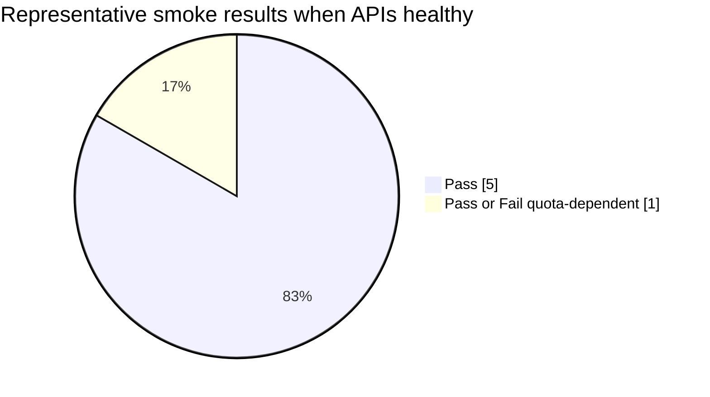

> The pie chart is an **illustrative** summary of the six-row matrix above (five unconditional passes plus one quota-dependent case), not logged production metrics.

---

## 6. Future Work

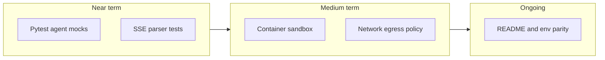

1. **Automated tests:** Pytest for agent loop behavior (mock `InferenceClient`), tool JSON shape, and stderr classification; lightweight frontend tests for SSE parsing.
2. **Stronger code isolation:** Run user code in a **container** or dedicated sandbox with network policy (e.g., allowlist finance APIs only) and resource limits.
3. **Docs and config parity:** Keep README, `.env.example`, and default frontend `API_URL` aligned with whichever backend (local vs Render) is intended for each environment.

---

*Generated to reflect the codebase as of the report authoring date.*
